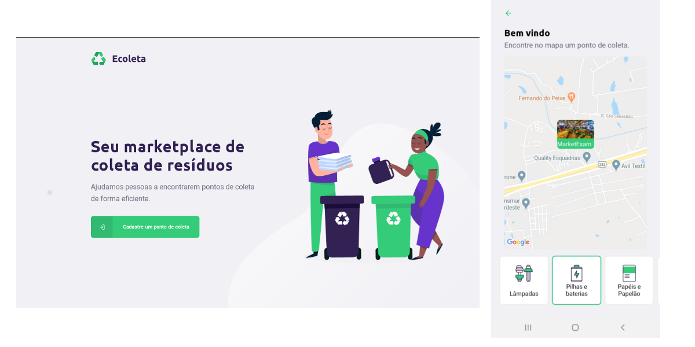

<h1 align="center"> 🚀NLW #01 - Ecoleta</h1>

  

  

  
  
  
  
  

<h3>💻 Tecnologias utilizadas</h3>

<ul>
  <li>TypeScript</li>
  <li>ReactJs</li>
  <li>Expo</li>
  <li>Figma</li>
  <li>Express</li>
  <li>Multer</li>
  <li>React Dropzone</li>
  <li>React Native Select Picker</li>
</ul>

<h3>🚀 Como usar este projeto</h3>

    # Clone este repósitório
    git clone https://github.com/leandro-wrf/next-level-week-01

    # Execute este projeto
    # backend
    cd next-level-week-01 && yarn
    yarn knex migrate:latest
    yarn seed:run
    yarn dev

    # frontend
    cd next-level-week-01 && yarn 
    yarn start

    # mobile
    cd next-level-week-01 && yarn
    expo start

<h3>🤓 O que obtive de conhecimento com este projeto</h3>

  Vamos começar pela parte mais importante do projeto, o TypeScript, está linguagem de desenvolvimento me encheu os olhos de paixão😍 durante a está semana, fiquei encantado com tudo que ela pode entregar e como ela torna simples manter o código, além de torna o código muito mais legível e de fácil compreenssão.

  Poder me utilizar do Typescript para conseguir criar o backend, frontend e mobile, foi incrível, estou coçando a mão e pensando em ideias de como poder explorar o poder que está linguagem me proporciona.

  O backend de certeza ainda é minha maior paixão e aprender a utilizar multer, foi um aprendizado e tanto, algo que já estava dentro da lista de estudos e que foi adiantado durante está semana. Utilizar o corpo Multipart Form do insomnia, me mostrou um caminho diferente, um novo lugar para explorar, o qual ainda não tinha passado na minha linha de estudos.
  ReactJS e Expo, são ótimas tecnologias aprendi muito está semana, dropzone uma lib fantástica e o select-picker no mobile, foi um ótimo desafio para poder focar muito melhor nas aulas.

  Está semana foi incrível e recheada de conteúdos novos. Valeu Rocketseat por tudo, agora é foco no estudos e vamos em frente!!(Ansioso👁👁 pela próxima edição).

<h3>📝Licença</h3>

Licença MIT.
